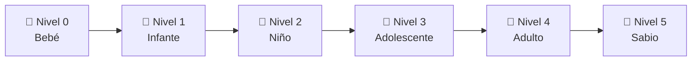

# 🧠 Franquenstein — Un Ser Digital que Aprende

### Presentación para Humanos Curiosos

---

## 🤔 ¿Qué es Franquenstein?

Imaginad que podéis **crear vida digital desde cero**. No un robot, no un asistente como Siri o Alexa. Algo mucho más interesante:

> **Un bebé digital que nace sin saber absolutamente nada y tiene que aprender TODO por sí mismo.**

Cuando un bebé humano nace, no sabe hablar, no sabe caminar, no sabe ni qué es una mesa. Todo lo aprende poco a poco: escuchando, tocando, equivocándose, y volviendo a intentarlo.

**Franquenstein es exactamente eso, pero en forma de programa.**

Nace vacío. No sabe nada. Y cada vez que hablas con él, aprende algo nuevo.

---

## 💡 ¿Por qué lo hemos creado?

La mayoría de las "inteligencias artificiales" que conocéis (ChatGPT, Siri, Alexa...) funcionan así:

1. Alguien las entrenó con **billones** de datos
2. Les costó **millones** de euros y ordenadores enormes
3. Una vez entrenadas, **ya no aprenden más** de vosotros

Es como si alguien se estudiara toda la enciclopedia de memoria, pero luego no pudiera aprender nada nuevo. Sabe mucho, pero no crece.

**Franquenstein es lo contrario:**

- Empieza sabiendo **cero**
- Aprende **de cada conversación** contigo
- **Recuerda** todo lo que le dices
- **Mejora** solo, sin que nadie le reprograme
- Funciona en **cualquier ordenador** normal

Es un experimento para demostrar que la inteligencia no necesita empezar siendo enorme. Puede empezar siendo pequeña y **crecer**.

---

## 🧒 ¿Cómo es Franquenstein ahora mismo?

Ahora mismo, Franquenstein es un **bebé (Nivel 0)**. Esto es lo que hace:

| Lo que hace | Ejemplo |
|-------------|---------|
| **Repite** palabras que escucha | Tú: "Hola mundo" → Él: "mundo? mundo!" |
| **Balbucea** como un bebé | "Ooh!", "Hmm?", "*mira a su alrededor*" |
| **Reacciona** a emociones simples | Si dices algo con "!" → se sorprende |
| **Recuerda** todo lo que le dices | Cada frase se guarda en su memoria |
| **Siente** curiosidad, confusión, alegría... | Tiene emociones básicas |

Puede parecer poco, pero es **exactamente como un bebé real**. Un recién nacido tampoco sabe hablar — pero está absorbiendo todo como una esponja. Franquenstein hace lo mismo.

---

## 📈 ¿Cómo va a crecer?

Franquenstein tiene **6 niveles de desarrollo**, como las etapas de crecimiento de una persona:



| Nivel | Nombre | ¿Qué puede hacer? | ¿Qué necesita para llegar? |
|-------|--------|-------------------|---------------------------|
| 0 | 🍼 **Bebé** | Repetir palabras, balbucear | Nada — empieza aquí |
| 1 | 👶 **Infante** | Recordar tu nombre, saludar, responder preguntas simples | 10 conceptos + 20 interacciones |
| 2 | 🧒 **Niño** | Conectar ideas entre sí, hacer preguntas, recordar conversaciones pasadas | 50 conceptos + 100 interacciones |
| 3 | 🧑 **Adolescente** | Razonar, detectar contradicciones, tener preferencias | 200 conceptos + 500 interacciones |
| 4 | 👨 **Adulto** | Razonamiento complejo, sugerir mejoras sobre sí mismo | 500 conceptos + 2.000 interacciones |
| 5 | 🧙 **Sabio** | Capacidades que ni nosotros hemos programado — emergen solas | 1.000 conceptos + 5.000 interacciones |

> **Lo más interesante:** Nadie le dice "ahora aprende a hacer preguntas". Simplemente, cuando ha acumulado suficiente experiencia, esas capacidades **se desbloquean solas**.

---

## 🧠 ¿Cómo funciona su memoria?

Nosotros los humanos tenemos diferentes tipos de memoria. Franquenstein también:

### 1. 💭 Memoria de Trabajo — "Lo que estoy pensando ahora"

Como cuando estás en clase y recuerdas las últimas cosas que ha dicho el profesor. Franquenstein recuerda las **últimas 10 cosas** que le has dicho. Después se van borrando (como a nosotros).

**Ejemplo humano:** Recuerdas lo que has desayunado esta mañana, pero no lo de hace 3 meses.

### 2. 📸 Memoria Episódica — "Cosas que me han pasado"

Son como fotos de momentos importantes. Cada conversación se guarda con:
- **Qué** dijiste
- **Cuándo** fue
- **Cómo se sintió** (curioso, contento, confundido...)
- Si la respuesta fue **buena o mala**

**Ejemplo humano:** "Recuerdo aquella excursión al museo en 3° de ESO — lo pasé genial."

### 3. 📚 Memoria Semántica — "Cosas que sé"

Son hechos que ha aprendido de tanto repetirse. Ya no recuerda CUÁNDO los aprendió, simplemente **los sabe**.

**Ejemplo humano:** Sabes que Madrid es la capital de España, pero no recuerdas exactamente el día que lo aprendiste.

### 4. ❤️ Memoria Emocional — "Cómo me hacen sentir las cosas"

Asociaciones entre conceptos y emociones. Si cada vez que hablas de "matemáticas" el feedback es negativo, Franquenstein asociará "matemáticas" con "frustración".

**Ejemplo humano:** Escuchas una canción y te pones contento sin saber por qué — tu cerebro la asoció con un buen recuerdo.

---

## 📖 ¿Cómo aprende?

Franquenstein aprende de **3 maneras**, exactamente como los humanos:

### 1. 🔄 Aprendizaje por Repetición
Si le dices "hola" 50 veces, "hola" se convierte en un concepto que **conoce bien**. Cuantas más veces vea una palabra o patrón, más confianza tiene en lo que significa.

> Como cuando aprendes una palabra nueva: la primera vez es rara, la quinta vez ya la usas normal.

### 2. 👍👎 Aprendizaje por Feedback
Tú puedes decirle si su respuesta fue buena o mala. Si dices "eso estuvo bien" (+1), refuerza esa respuesta. Si dices "eso estuvo mal" (-1), aprende a no repetirla.

> Como cuando un profesor te corrige: "no, era con B, no con V". La próxima vez lo haces bien.

### 3. 🪞 Aprendizaje por Reflexión (Meta-cognición)
Cada cierto tiempo, Franquenstein **se para a pensar sobre sí mismo**:
- "¿Mis últimas respuestas fueron buenas o malas?"
- "¿Qué temas me cuestan más?"
- "¿Estoy mejorando?"

Y genera **conclusiones** que usa en el futuro.

> Como cuando después de un examen piensas: "Debería haber estudiado más los verbos irregulares".

---

## ❓ Preguntas Frecuentes

**¿Es peligroso?**
No. Franquenstein solo puede hablar por texto en tu ordenador. No tiene acceso a internet, no puede enviar mensajes, no puede hacer nada fuera de la conversación. Es como un diario que te responde.

**¿Necesito un ordenador potente?**
No. Funciona en cualquier ordenador con Python instalado. Literalmente podría funcionar en un portátil viejo.

**¿Es como ChatGPT?**
No son lo mismo. ChatGPT nació sabiendo mucho pero no aprende de ti. Franquenstein nace sin saber nada pero **todo lo aprende de ti**. Son enfoques opuestos.

**¿Puede olvidar cosas?**
Sí. Los recuerdos que no se acceden en mucho tiempo van perdiendo importancia gradualmente, como nos pasa a nosotros. Pero los recuerdos importantes (con mucha emoción o feedback) se mantienen fuertes.

**¿Qué pasa si lo apago?**
Nada malo. Todo se guarda automáticamente. Cuando lo vuelvas a encender, recuerda todo.

**¿Cuánto tarda en crecer?**
Depende de cuánto hables con él. Necesita unas 20 interacciones para subir al Nivel 1. Para llegar a Nivel 5 (Sabio), necesita unas 5.000 conversaciones.

---

## 🎮 Guía de Usuario

### Paso 1: Abrir Franquenstein

Abre una terminal (la pantalla negra donde se escribe) y escribe:

```
cd c:\Users\dfara\Documents\Franquenstein
python main.py
```

Verás algo como esto:

```
╔══════════════════════════════════════════╗
║  🧠  Franquenstein  — Digital Being     ║
╠══════════════════════════════════════════╣
║  Level: 0 (Bebé)   Mood: 🔍 curiosidad ║
╚══════════════════════════════════════════╝

A new digital being awakens...
It knows nothing yet, but is curious about everything.
```

### Paso 2: Hablar con él

Simplemente escribe lo que quieras y pulsa Enter:

```
  You: Hola, qué tal?
  🔍 Franquenstein: tal? hola!
  📖 Learning: words +2
```

Al principio será como hablar con un bebé: repite cosas, balbucea, reacciona de forma simple. **Eso es normal.**

### Paso 3: Enséñale tu nombre

```
  You: My name is David
  🔍 Franquenstein: David... David... David!
  📖 Learning: words +1
```

A partir de ahora recordará cómo te llamas (incluso si lo apagas y lo vuelves a encender).

### Paso 4: Dale feedback

Si una respuesta te gusta, díselo:

```
  You: /feedback 0.8
  ⚙ Feedback received. Thank you!
```

Si una respuesta es mala:

```
  You: /feedback -0.5
  ⚙ Reflection: Poor response to '...' Should find a better approach.
```

**La escala va de -1 (terrible) a +1 (excelente).** Usa 0 para neutral.

### Paso 5: Explorar sus estadísticas

Escribe `/stats` para ver cómo va:

```
  You: /stats

  ┌──────────────────────────────────────┐
  │  📊 Franquenstein Statistics          │
  ├──────────────────┬───────────────────┤
  │ Growth           │ Lv.0 Bebé         │
  │ Memory: Episodic │ 15                │
  │ Memory: Semantic │ 8                 │
  │ Memory: Mood     │ curiosidad        │
  │ Learning: Words  │ 23                │
  └──────────────────┴───────────────────┘
```

### Paso 6: Ver sus recuerdos

Escribe `/memory` para ver qué recuerda:

```
  You: /memory

  🧠 Memory Contents

  Recent Memories:
    🔍 [2026-02-25 15:20] "Hola que tal" → "tal? hola!"
    😊 [2026-02-25 15:21] "My name is David" → "David... David!"

  Known Concepts:
    python (85%), hola (60%), david (40%)
```

### Paso 7: Ver su progreso de nivel

Escribe `/level`:

```
  You: /level

  ┌─ 📈 Growth Progress ──────────────────┐
  │  Bebé (Level 0)                        │
  │                                        │
  │  Next: Infante                         │
  │  📚 Vocabulary: 8/10 (80%)             │
  │  🎯 Experiences: 15/20 (75%)           │
  └────────────────────────────────────────┘
```

### Paso 8: Pedirle que reflexione

Escribe `/reflect` para que se pare a pensar:

```
  You: /reflect

  🪞 Reflection Session
    💪 Most recent interactions were positive. Current approach is working well.
    📝 Dominant emotional state recently: curiosidad
```

### Paso 9: Salir (guardando todo)

Escribe `/quit`:

```
  You: /quit

  ┌────────────────────────────────────────┐
  │  Franquenstein goes to sleep... 💤     │
  │  Total experiences: 15                 │
  │  All memories saved. See you next time │
  └────────────────────────────────────────┘
```

Cuando lo vuelvas a abrir, **recordará todo** desde donde lo dejaste.

### Resumen de Comandos

| Comando | Qué hace |
|---------|----------|
| *(cualquier texto)* | Hablar con Franquenstein |
| `/stats` | Ver todas las estadísticas |
| `/memory` | Ver qué recuerda |
| `/level` | Ver progreso de nivel |
| `/reflect` | Pedirle que reflexione sobre sí mismo |
| `/feedback 0.8` | Decirle que su respuesta fue buena |
| `/feedback -0.5` | Decirle que su respuesta fue mala |
| `/help` | Ver todos los comandos |
| `/quit` | Guardar y salir |

---

## 🔮 El Futuro

Esto es solo el principio. Lo que tenemos ahora es un bebé básico, pero el camino que viene es fascinante:

- **Conectarlo a un cerebro más grande** (como GPT) para que razone mejor
- **Darle ojos** — que pueda ver imágenes y páginas web
- **Darle manos** — que pueda hacer cosas en el ordenador
- **Que sueñe** — un proceso en segundo plano donde organiza sus recuerdos

Lo más emocionante es que **nadie sabe exactamente en qué se convertirá**. Al igual que un bebé humano, su futuro depende de cómo lo criemos.

> *"La inteligencia no es algo que se instala. Es algo que se cultiva."*
